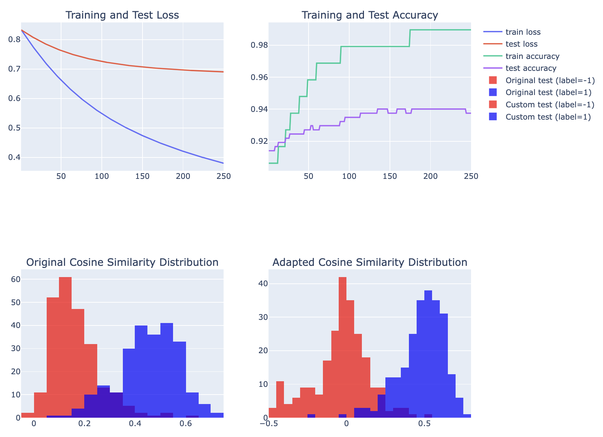

# weightgain

**Train an adapter for _any_ embedding model in under a minute.**

The best embedding models are locked behind an API (OpenAI, Cohere, Voyage, etc.) and can't be fine-tuned. To get around this, you can train an adapter. This is a matrix of weights you can multiply your embeddings by to optimize them for retrieval over your specific data.

`weightgain` lets you train an adapter in a couple lines of code, even if you don't have a dataset.

## Installation

```bash
> pip install weightgain
```

## Quickstart

```python
from weightgain import Dataset, Adapter, Model

# Choose an embedding model
model = Model("openai/text-embedding-3-large")

# Generate synthetic data (or supply your own)
dataset = Dataset.from_synthetic_chunks(
    prompt="Chunks of code from an arbitrary Python codebase.",
    model=model,
    llm="openai/gpt-4o-mini",
    n_chunks=25,
    n_queries_per_chunk=5
)

# Train the adapter
adapter = Adapter.train(dataset)

# Generate a new embedding
embedding = model.get_embedding("Embed this sentence")
new_embedding = adapter @ embedding # matrix multiplication
```

## Usage

### Choosing an Embedding Model

Weightgain wraps LiteLLM to get access to model APIs. You can see the full list of supported embedding models [here.](https://docs.litellm.ai/docs/embedding/supported_embedding)

<!--TODO: You can also define your own-->

### Building the Dataset

You need a dataset of `[query, chunk]` pairs to get started. A chunk is a retrieval result, e.g. a code snippet or excerpt from a document. You can either generate a synthetic dataset or supply your own.

**If you already have chunks:**

```python
from weightgain import Dataset

chunks = [...] # list of strings
model = Model("openai/text-embedding-3-large")
dataset = Dataset.from_chunks(
    chunks,
    model,
    llm="openai/gpt-4o-mini",
    n_queries_per_chunk=1
)
```

This will use `gpt-4o-mini` (or whatever LiteLLM model you want) to generate `1` query per chunk.

**If you don't have chunks:**

```python
dataset = Dataset.from_synthetic_chunks(
    prompt="Chunks of code from an arbitrary Python codebase.",
    model=model,
    llm="openai/gpt-4o-mini",
    n_chunks=25,
    n_queries_per_chunk=1
)
```

This will generate chunks using the prompt, and then generate `1` query per chunk.

**If you have queries and chunks:**

```python
qa_pairs = [...] # list of (str, str) tuples
dataset = Dataset.from_pairs(qa_pairs, model)
```

### Training the Adapter

```python
from weightgain import Adapter

adapter = Adapter.train(
    dataset,
    batch_size=25,
    max_epochs=50,
    learning_rate=100.0,
    dropout=0.0
)
```

After training, you can generate a report with various plots (training loss, cosine similarity distributions before/after training, etc.):

```python
adapter.show_report()
```



### Using the Adapter

Behind the scenes, the adapter is just a `numpy` matrix that you can multiply your embeddings with:

```python
embedding = model.get_embedding("Embed this sentence")
new_embedding = adapter @ embedding
```

You can access this matrix directly too:

```python
adapter.matrix # returns numpy.ndarray
```

## Roadmap

1. Add option to train an MLP instead of a linear layer
2. Add a method for easy hyperparameter search
3. Move the embedding step to `Adapter.train` instead of dataset creation
